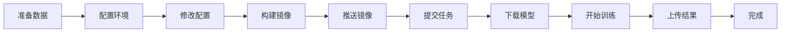

# Swift 框架微调 Qwen3-VL 模型 - Vertex AI 训练指南

这是一个在 Google Cloud Vertex AI 上使用 Swift 框架微调 Qwen3-VL-4B 模型的完整训练项目，专门用于图纸孔检测任务。

## 🚀 快速开始（3 步）

### 步骤 1: 环境设置（首次使用）

```bash
cd /Users/lmx/code/gcl_swift_sft

# 登录 Google Cloud
gcloud auth login
gcloud config set project im-drawing-462011

# 自动配置环境（创建 Service Account、Buckets、权限）
./setup_service_account.sh
```

### 步骤 2: 提交训练任务

```bash
# 运行交互式提交脚本
./custom_job.sh

# 选择选项 3（构建镜像 + 推送 + 提交任务）
```

### 步骤 3: 监控训练

```bash
# 查看任务列表
gcloud ai custom-jobs list --region=us-central1 --limit=5

# 查看实时日志（替换 JOB_NAME）
gcloud ai custom-jobs stream-logs JOB_NAME --region=us-central1

# Web 控制台
https://console.cloud.google.com/vertex-ai/training/custom-jobs?project=im-drawing-462011
```

**完成！** 模型会自动从 Hugging Face 下载并开始训练。

---

## 📁 项目结构

```
gcl_swift_sft/
├── Dockerfile              # Docker 镜像（PyTorch 2.5.1 + CUDA 12.4）
├── requirements.txt        # Python 依赖（Swift、DeepSpeed 等）
├── train.sh               # 训练启动脚本（支持 GCS/HF 模型）
├── custom_job.sh          # Vertex AI 任务提交脚本（交互式）
├── setup_service_account.sh  # 自动配置脚本
├── config.env.example     # 配置模板
├── .dockerignore          # Docker 构建优化
└── bard/                  # 训练数据和脚本
    ├── view.jsonl         # 训练数据集
    ├── view_ex.jsonl      # 扩展数据集
    ├── train_data/        # 训练图像（449 张）
    ├── train_data_ex/     # 扩展图像（449 张）
    └── flash_attn-*.whl   # Flash Attention 预编译包
```

---

## ⚙️ 核心配置

### 默认配置

| 配置项 | 默认值 | 说明 |
|--------|--------|------|
| **模型** | `Qwen/Qwen3-VL-4B-Instruct` | 从 Hugging Face 自动下载 |
| **机器类型** | a2-highgpu-1g | 1x A100 (40GB) |
| **训练轮数** | 2 epochs | 可修改 |
| **批次大小** | 1 | 每设备批次 |
| **学习率** | 1e-4 | LoRA 学习率 |
| **LoRA Rank** | 8 | LoRA 配置 |
| **训练时间** | 2-4 小时 | 约 898 样本 |
| **预计成本** | $7-15 | 2 epochs |

### 修改配置

#### 1. 更换模型

编辑 `custom_job.sh` 第 25 行：

```bash
MODEL_PATH="Qwen/Qwen3-VL-4B-Instruct"     # 4B（默认）
# MODEL_PATH="Qwen/Qwen2-VL-2B-Instruct"   # 2B（更小更快）
# MODEL_PATH="Qwen/Qwen2-VL-7B-Instruct"   # 7B（更强）
```

#### 2. 更换机器类型

编辑 `custom_job.sh` 第 17-21 行：

```bash
# 单卡 A100 (40GB) - 默认
MACHINE_TYPE="a2-highgpu-1g"
ACCELERATOR_COUNT=1

# 双卡 A100 (80GB) - 更快
# MACHINE_TYPE="a2-highgpu-2g"
# ACCELERATOR_COUNT=2
```

#### 3. 修改训练参数

编辑 `train.sh` 第 20-26 行：

```bash
NUM_EPOCHS="${NUM_EPOCHS:-2}"           # 训练轮数
BATCH_SIZE="${BATCH_SIZE:-1}"           # 批次大小
LEARNING_RATE="${LEARNING_RATE:-1e-4}"  # 学习率
LORA_RANK="${LORA_RANK:-8}"            # LoRA rank
LORA_ALPHA="${LORA_ALPHA:-32}"         # LoRA alpha
MAX_LENGTH="${MAX_LENGTH:-3000}"        # 最大序列长度
```

---

## 🔧 高级功能

### 使用需要认证的模型

如果模型需要 Hugging Face Token：

1. 获取 Token：https://huggingface.co/settings/tokens
2. 编辑 `custom_job.sh` 第 28 行：
   ```bash
   HF_TOKEN="hf_your_token_here"
   ```

### 使用 GCS 存储的模型

适合频繁训练的场景：

```bash
# 1. 上传模型到 GCS
gsutil -m cp -r /path/to/model gs://im-drawing-462011-models/my-model

# 2. 修改 custom_job.sh
MODEL_PATH="gs://im-drawing-462011-models/my-model"
```

### 多 GPU 训练

修改 `custom_job.sh`：

```bash
MACHINE_TYPE="a2-highgpu-2g"
ACCELERATOR_COUNT=2
```

脚本会自动启用 DeepSpeed Zero3。

### 查看训练输出

```bash
# 列出输出目录
gsutil ls gs://im-drawing-462011-outputs/swift-training/

# 下载某次训练结果
gsutil -m cp -r gs://im-drawing-462011-outputs/swift-training/TIMESTAMP/ ./output/
```

---

## 📊 成本与性能

| 机器类型 | GPU | 价格/小时 | 训练时间 | 总成本 |
|----------|-----|-----------|----------|--------|
| a2-highgpu-1g | 1x A100 | $3.67 | 2-4h | $7-15 |
| a2-highgpu-2g | 2x A100 | $7.34 | 1-2h | $7-15 |

*基于 898 训练样本（2 数据集）*

---

## 🐛 故障排查

### 常见问题

| 问题 | 原因 | 解决方案 |
|------|------|----------|
| **Permission Denied** | 权限不足 | 运行 `./setup_service_account.sh` |
| **Model not found** | 模型路径错误 | 检查 Hugging Face 模型 ID |
| **OOM Error** | 显存不足 | 减小 `BATCH_SIZE` 或使用更大机器 |
| **Build failed** | Docker 错误 | 检查 `Dockerfile` 语法 |
| **Download slow** | 网络慢 | 考虑使用 GCS 缓存 |

### 调试命令

```bash
# 本地测试镜像构建
docker build -t test-image .

# 检查 GCS 访问
gsutil ls gs://im-drawing-462011-models/

# 验证 Service Account 权限
gcloud projects get-iam-policy im-drawing-462011 \
  --flatten="bindings[].members" \
  --filter="bindings.members:vertex-ai-training@"

# 查看详细日志
gcloud ai custom-jobs describe JOB_NAME --region=us-central1

# 取消任务
gcloud ai custom-jobs cancel JOB_NAME --region=us-central1
```

---

## 💡 最佳实践

### 1. 成本优化

- ✅ 使用 `.dockerignore` 减小镜像大小
- ✅ 首次训练后将模型缓存到 GCS
- ✅ 及时删除不需要的输出
- ✅ 使用合适的机器类型（不要过度配置）

### 2. 性能优化

- ✅ 启用 Flash Attention（已默认配置）
- ✅ 使用 bfloat16 混合精度（已默认配置）
- ✅ 启用梯度检查点节省显存
- ✅ 多 GPU 时自动启用 DeepSpeed

### 3. 数据管理

- ✅ 训练数据已打包在镜像中
- ✅ 输出自动上传到 GCS（带时间戳）
- ✅ 使用 JSONL 格式（Swift 标准格式）

---

## 📝 数据格式

训练数据采用 Swift/JSONL 格式：

```json
{
  "messages": [
    {
      "role": "user",
      "content": "<image>\n任务描述..."
    },
    {
      "role": "assistant",
      "content": "```json\n[检测结果...]\n```"
    }
  ],
  "images": ["train_data/image.png"]
}
```

---

## 🔄 完整工作流程



### 详细步骤

1. **准备数据** → `bard/view.jsonl` 和图像已准备好
2. **配置环境** → 运行 `./setup_service_account.sh`
3. **修改配置** → 编辑 `custom_job.sh`（可选）
4. **构建镜像** → Docker 自动构建
5. **推送镜像** → 推送到 Artifact Registry
6. **提交任务** → 创建 Vertex AI Custom Job
7. **下载模型** → 从 Hugging Face 自动下载
8. **开始训练** → Swift LoRA 微调
9. **上传结果** → 自动上传到 GCS
10. **完成** → 下载并使用模型

---

## 📚 技术栈

- **基础镜像**: PyTorch 2.5.1 + CUDA 12.4 + cuDNN 9
- **训练框架**: ms-swift (ModelScope Swift)
- **模型**: Qwen3-VL-4B-Instruct (通义千问视觉语言模型)
- **微调方法**: LoRA (Low-Rank Adaptation)
- **加速**: Flash Attention 2.8.3
- **分布式**: DeepSpeed Zero3 (多 GPU)
- **云平台**: Google Cloud Vertex AI

---

## 🎯 后续步骤

训练完成后：

### 1. 下载模型

```bash
# 找到输出路径
gsutil ls gs://im-drawing-462011-outputs/swift-training/

# 下载模型
gsutil -m cp -r gs://.../output/checkpoint-XXX ./my-model/
```

### 2. 合并 LoRA 权重

```bash
cd bard/
# 编辑 export.sh 修改 checkpoint 路径
./export.sh
```

### 3. 本地测试

```python
from transformers import Qwen3VLForConditionalGeneration, AutoProcessor

model = Qwen3VLForConditionalGeneration.from_pretrained("./checkpoint-XXX-merged")
processor = AutoProcessor.from_pretrained("./checkpoint-XXX-merged")

# 推理代码
# ...
```

### 4. 评估模型

```bash
cd bard/
python eval.py
```

---

## 🤝 获取帮助

- **查看日志**: `gcloud ai custom-jobs stream-logs JOB_NAME --region=us-central1`
- **Qwen 文档**: https://github.com/QwenLM/Qwen-VL
- **Swift 文档**: https://github.com/modelscope/swift
- **Vertex AI 文档**: https://cloud.google.com/vertex-ai/docs/training

---

## 📄 许可证

MIT License

---

**项目状态**: ✅ 生产就绪

**最后更新**: 2025-10-29

**维护者**: lmx
